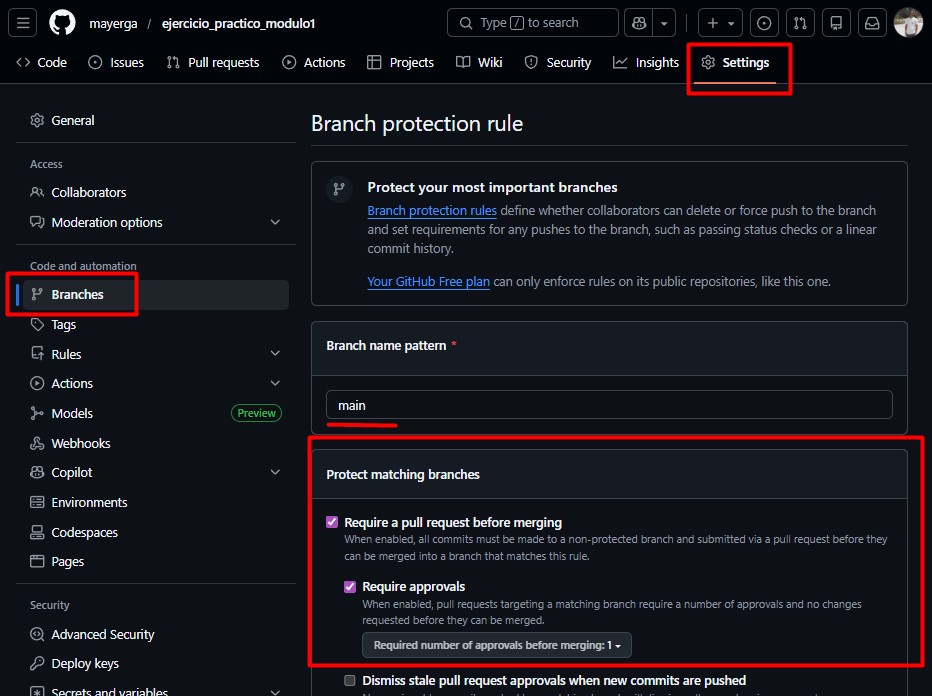
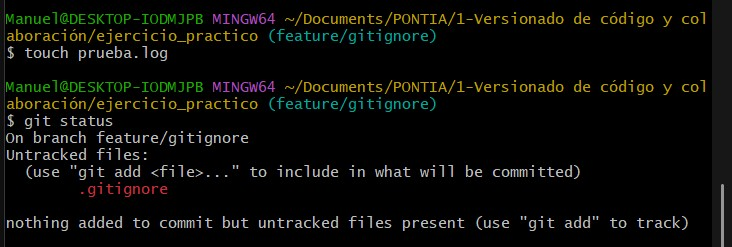
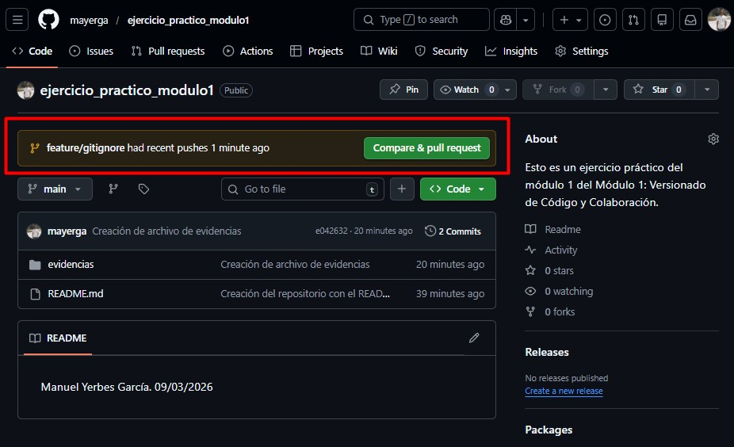
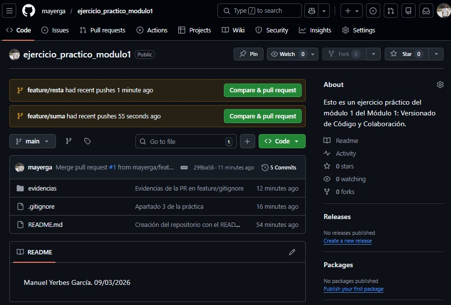

# Evidencias
La seguridad que he llevado a cabo, la cual me enseñó el profesor Iván, fue ir, dentro de mi repositorio creado, a Settings > Branches > Add branch protection rule

Con esto, lo que hago es que no se permitan pushs directos sobre la rama main. También, he puesto que al menos, haya una aprobación antes de realizar el merge y aprobar el PR.

Con esto, lo que hago es proteger la rama main ante posibles errores.

## Imagen que lo demuestra

# Evidencias .GITIGNORE
Después de crear el .gitignore, creo el archivo de prueba.log.
Después, ejecuto 'git status' y se ve en la imagen, como no aparece en la lista de 'untracked files'.

## Imagen que lo demuestra

Resultado del git status se encuentra en el archivo evidencias/evidencias-status.txt

## Imagen que muestra la PR

# Evidencias Creación de ramas
Ahora, tengo que resolver estas dos PRs creadas desde dos diferentes ramas (feature/resta y feature/suma)

## Imagen que lo demuestra

